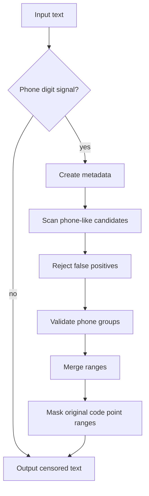
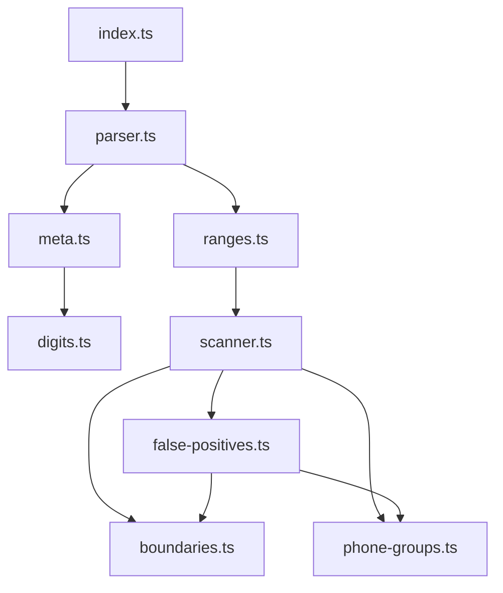

# Phone Filter Architecture

## Goals

`@textfilters/phone` censors phone-like sequences while staying composable with
other text filters. The package keeps compatibility behavior by preserving the
existing public API, code point range semantics, and false-positive behavior.

Phone matching is Unicode-aware: metadata folds Unicode decimal digits into ASCII
digits while preserving source code point positions. False-positive guards are
necessary because many non-phone numeric shapes look phone-like: coordinates,
dates, times, IP addresses, server endpoints, balances, and formatted amounts.

## Public API

The public API is intentionally small:

- `createPhoneFilter(config?)` creates a censor with optional configuration.
- `filter` is the default shared phone filter instance.
- `phoneFilter` is an alias for `createPhoneFilter`.
- `PhoneFilterConfig` currently supports `maskChar`.
- `maskChar` is normalized by `@textfilters/core` before masking.
- `createPhoneScanner()` exposes the same matching behavior as a range scanner.
- `createPhoneScanner().check(input)` returns a boolean without collecting all
  ranges.
- `createPhoneScanner().scan(input, sink)` streams ranges and supports early
  stop when the sink returns `false`.
- `scanPhoneRanges(text)` returns code point ranges directly for callers that
  want to compose masking through `@textfilters/core`.

Parser modules are internal implementation details and are not package exports.

## High-Level Flow

## Module Map

## File Responsibilities

| File                     | Responsibility                                                          | Out of scope                                            |
| ------------------------ | ----------------------------------------------------------------------- | ------------------------------------------------------- |
| `src/index.ts`           | Public entrypoint, scanner facade, prefilter, and filter orchestration. | Parser internals or package-private matching details.   |
| `src/parser.ts`          | Thin internal facade for the entrypoint.                                | Candidate scanning, validation, or false-positive code. |
| `src/digits.ts`          | Unicode decimal digit folding and raw character mapping.                | Text metadata arrays or candidate scanning.             |
| `src/meta.ts`            | Code point metadata and character classification.                       | Phone-specific validation rules.                        |
| `src/boundaries.ts`      | Boundary checks, cursors, and extension edge parsing.                   | Date, coordinate, IP, or amount rules.                  |
| `src/phone-groups.ts`    | Group count, digit count, plus, and parentheses rules.                  | Text scanning or false-positive classification.         |
| `src/false-positives.ts` | Guards for numeric shapes that are probably not phones.                 | Public API exports or final range merging.              |
| `src/scanner.ts`         | Candidate reads, rejected-run tracking, and range emits.                | Final range merging or mask application.                |
| `src/ranges.ts`          | Candidate collection and final range merge facade.                      | Low-level parsing rules.                                |

## Matching Strategy

Matching starts from code point metadata. `meta.ts` stores the original source
code points alongside raw normalized characters, zero-width flags, digit flags,
word character flags, and group separator flags. Raw characters are normalized
with NFKC and lowercasing through `@textfilters/core`, then Unicode decimal
digits are folded to ASCII in `digits.ts`.

Before metadata creation, the public scanner checks for a cheap folded digit
count signal. Shared-style hints such as digit count, plus sign, punctuation, and
text length can reject low-digit text before candidate parsing. Clearly clean
text returns no ranges without candidate parsing; numeric candidate text still
runs through the same group validation and false-positive guards as before.

The raw arrays and source code point arrays stay aligned: every source code point
has exactly one metadata slot. Zero-width code points can be skipped by cursors
without removing them from source ranges. Combining marks and group separators
keep the same behavior as the original parser so masking still covers the source
code points that belong to a detected token.

`scanner.ts` reads candidate runs from the metadata, tracks groups, separators,
plus signs, parentheses, and rejected runs. `phone-groups.ts` performs final
group validation after false-positive checks have preserved structured prefixes
or rejected non-phone numeric runs.

## False Positive Strategy

`false-positives.ts` identifies numeric structures that should not be censored:

- coordinates with latitude and longitude limits;
- dates and datetime prefixes;
- times with optional seconds, fractions, and compact time zones;
- IPv4, IPv4 ports, CIDR-like prefixes, and IPv6 tail fields;
- balance or thousand-separated values;
- decimal, price-like, amount-like, and version-like prefixes.
- the signed 32-bit minimum sentinel, exact 13-digit JSON `serverTs` values,
  and 13-digit JSON `cursor` values with an optional `-0` suffix; later groups
  remain eligible for phone suffix recovery, and JSON whitespace is parsed
  structurally without a fixed look-back window.

Some prefixes are rejected only until the end of the structured part. This lets a
valid phone after a neutral numeric prefix still be rescanned and censored.

## Range And Masking Rules

All ranges are code point ranges over the original source text. `scanner.ts`
collects candidate ranges without mutating the input. `ranges.ts` merges
overlapping or adjacent ranges through `@textfilters/core`.

Masking is applied only after all ranges are collected. This preserves source
length, avoids scan-order side effects, and keeps repeated censoring idempotent
for already masked output.

## Change Guide

| Change                                      | Where to change                |
| ------------------------------------------- | ------------------------------ |
| Add support for another Unicode digit block | `digits.ts` + public API tests |
| Change metadata classification              | `meta.ts` + tests              |
| Change word boundary behavior               | `boundaries.ts` + tests        |
| Change valid phone grouping                 | `phone-groups.ts` + tests      |
| Change date/coordinate/time rejection       | `false-positives.ts` + tests   |
| Change candidate scanning                   | `scanner.ts` + tests           |
| Change final range merging                  | `ranges.ts` + tests            |

## Safety Rules

- Do not expose parser internals as public API.
- Do not weaken false-positive guards without compatibility tests.
- Do not normalize in a way that breaks code point range alignment.
- Do not mask while scanning.
- Keep tests public-API oriented.
